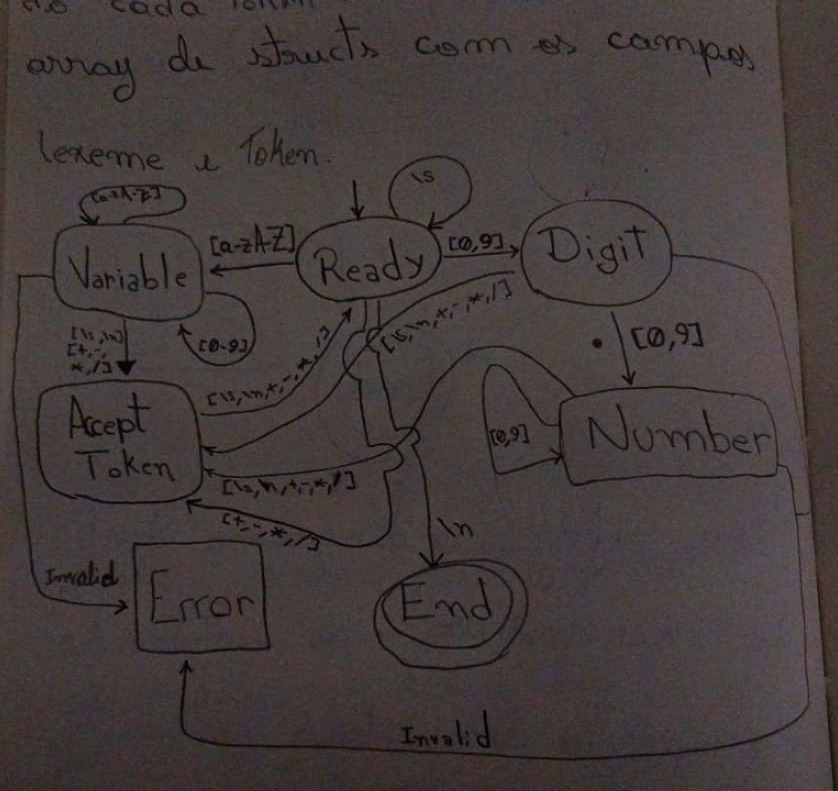

# Interpretation of mathematical expression

The purpose of this part of the project is to create the capability to interpret and generate graphics from the text (images, animations, or an interactive screen). I'll start by implementing a modified version of the shunting yard algorithm, and then I'll think about how to make something that interfaces nicely with the curves/function graph generation and allows easy usage of it in an HTML page or other places (terminal, for example). 

I think the main question for this part is: make the modified version of shunting yard to transform prefix notation in postfix notation and then make a parser for this postfix that generates an AST which the main program can deal with, or make the parser for the prefix rigth away. The second option makes much more sense, but I've never done it, so I decided on the first approach, because it seems more rich educationally.

## 09/08/2026

This is the diagram to the automaton that I'll use for the lexer. Actually, I'll not use the [a-zA-Z] for variable in the second implementation, but it will be very similar to this.

